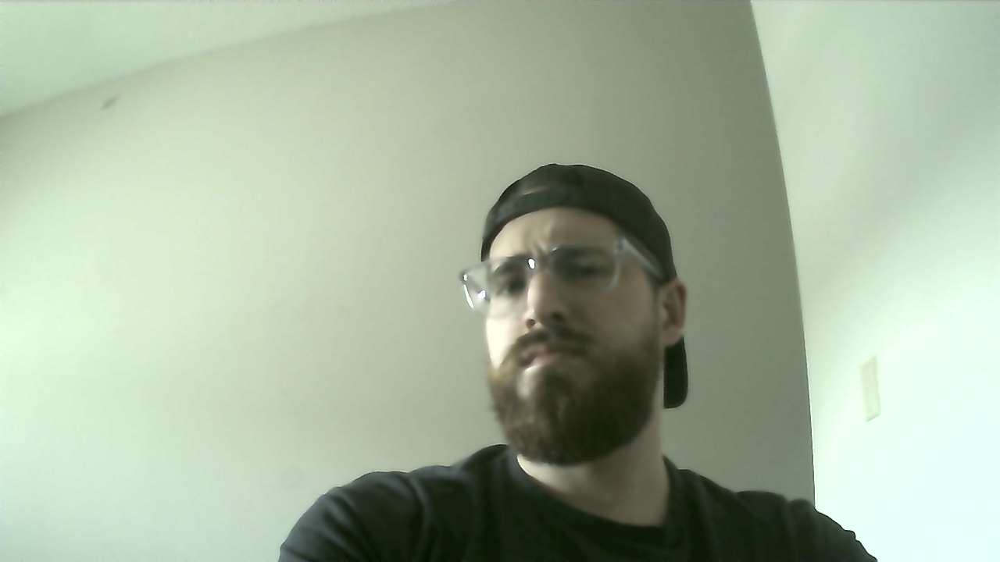

# Beard Fidget Monitor
I've recently noticed that I fidget with my beard LOTS - when I'm driving, when I'm watching TV, when I'm sitting at my desk and not using both hands to work, etc. I've also noticed that my beard is getting thinner as a result from the constant fidgeting (and I sometimes end up pulling some hairs out...). I've tried breaking this habit myself with no luck so it's time to take a different approach - the Raspberry Pi Beard Fidget Monitor.\
The idea here is to stream a video of myself while I'm sitting at my desk to a feature detection/image classification algorithm which will warn me when I start playing with my beard by setting off a buzzer and flashing an obnoxiously bright light in my face. Here is that project's story.


## Hardware
1. [Raspberry Pi](https://www.canakit.com/raspberry-pi-3-model-b-plus.html)
2. [USB Webcam](https://www.amazon.ca/gp/product/B08HYDZ6TN/ref=ppx_yo_dt_b_asin_image_o00_s00?ie=UTF8&psc=1)


## Procedure
1. Set up the pi, get the camera going, and collect a dataset for training.


## Setup

### Capturing Images
After doing minimal research, I figured [fswebcam](http://manpages.ubuntu.com/manpages/bionic/man1/fswebcam.1.html) would be the route to go to in order to capture images used for the training dataset. I tried using the "default" settings found on the [Raspberry Pi Guide's webcam tutorial page](https://raspberrypi-guide.github.io/electronics/using-usb-webcams) and ended up with some questionable results.

```
sudo apt install fswebcam
mkdir images
cd images
fswebcam -r 1280x720 --no-banner test_image.jpg
```



I found the colors to be super green-washed, so I hooked the camera up to my laptop and captured another sample image:

<!--  -->

Obviously this is a Pi issue since this webcam is capable of taking proper images when hooked up to my laptop. I played with some of the fswebcam arguments and found that the first few images need to be discarded in order to get a properly color-balanced picture. A delay of a few seconds did not solve the trick but a discard of 10 seemed to produce good results the majority of the time.

<!--  -->

A very poorly thought out python script was written `beard_fidget_monitor/misc/capture_training_images.py` and I'd let that run for a few hours over the course of a few days in order to collect a large enough sample set with different lighting and angles to properly train the model. 
